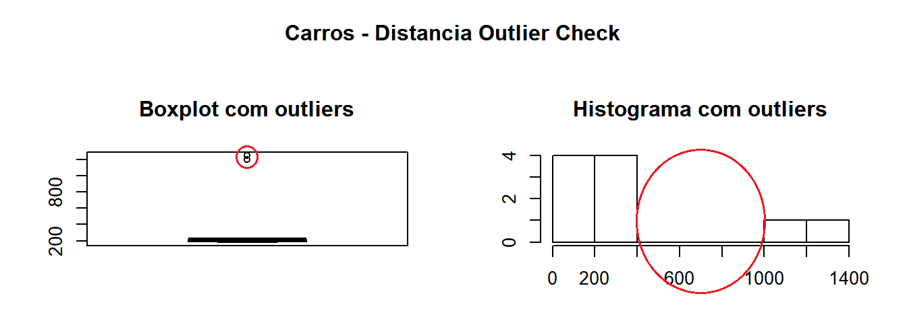
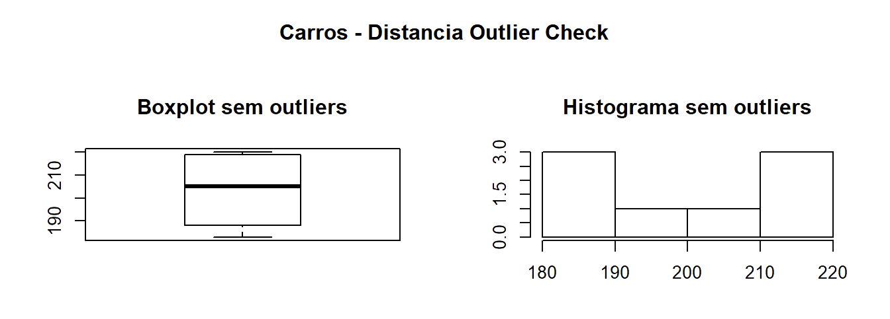

Em estatística, o **outlier** (também conhecidos como **valor aberrante** ou **valor atípico**) é uma observação que apresenta uma grande diferença dos demais valores ou até mesmo inconsistente.

A existência de _outliers_ implica em uma interpretação errada dos resultados estatísticos. 

Existem vários métodos de identificação de _outliers_, nesse artigo vamos utilizar o gráfico de `boxplot.stats` e `hist`.

Para uma melhor apresentação e comparação, vamos criar um método chamado `outlierInfo` que plota os gráficos com e sem os outliers, com isso, temos uma visão mais nítida comparando os dados.

```{r}
#outlierInfo: fornece uma analise sobre possiveis outliers em um dado
outlierInfo <- function(dt, var, labelName = "", showMessage = FALSE, removeOutlier = FALSE) {
	varName <- eval(substitute(var), eval(dt))

    tot <- sum(!is.na(varName)) #Total de itens nao null
    na1 <- sum(is.na(varName)) #Total de itens null
    m1 <- mean(varName, na.rm = T) #Media dos itens

    #Criando grafico com os outliers
	par(mfrow = c(2, 2), oma = c(0, 0, 3, 0))
    boxplot(varName, main = "Boxplot com outliers")
    hist(varName, main = "Histograma com outliers", xlab = NA, ylab = NA)
    outlier <- boxplot.stats(varName)$out

    #Criando grafico sem os outliers
    varName <- ifelse(varName %in% outlier, NA, varName)
    boxplot(varName, main = "Boxplot sem outliers")
    hist(varName, main = "Histograma sem outliers", xlab = NA, ylab = NA)
	title(paste(labelName, "Outlier Check"), outer = TRUE)
    na2 <- sum(is.na(varName))

    #Calculando dados com e sem outliers
	outliersCount = na2 - na1
	outliersPercent = ((na2 - na1) / tot * 100)
	meanoutliers <- mean(outlier)
	meanWithOutliers = m1
    meanWithoutOutliers = mean(varName, na.rm = T)

    #Remove os outliers conforme o parametro
	if (removeOutlier) {
		dt[as.character(substitute(var))] <- invisible(var_name)
		assign(as.character(as.list(match.call())$dt), dt, envir = .GlobalEnv)
	}

    #Apresenta informações sobre os dados conforme o paramtro
	if (showMessage) {
		message(labelName, " observations:")
		message("Outliers identified: ", outliersCount, " from ", tot, " observations")
		message("Proportion (%) of outliers: ", outliersPercent)
		message("Mean of the outliers: ", meanoutliers)
		message("Mean with outliers: ", meanWithOutliers)
		message("Mean without outliers: ", meanWithoutOutliers)
	}

    #Crio variavel de retorno
	results <- list()

    #Preencho os dados da variavel de retorno
    results$withoutOutliers <- varName[!is.na(varName)]
	results$withOutliers <- var
	results$outliers <- outlier
	results$outliersCount <- outliersCount
	results$outliersPercent <- outliersPercent
	results$meanoutliers <- meanoutliers
	results$meanWithOutliers <- meanWithOutliers
	results$meanWithoutOutliers <- meanWithoutOutliers

    #Retorno a variavel
	return(invisible(results));
}
```

Após criado o método, vamos criar o dataframe com os dados do _outliers_ na variável `dataOutliers`.
```{r}
dataOutliers <- data.frame(speed = c(18, 19, 19, 20, 20, 20, 23, 22, 25, 25), dist = c(183, 190, 186, 210, 220, 218, 220, 200, 1200, 1250))
```

O dataframe possui 2 colunas, *speed* e *dist*, onde na coluna *speed* passamos os valores `[18, 19, 19, 20, 20, 20, 23, 22, 25, 25]` e na coluna *dist* passamos os valores `[183,190, 186, 210, 220, 218, 220, 200, 1200, 1250]`.

O dataframe possui 2 colunas, *speed* e *dist*, onde na coluna *speed* passamos os valores `[18, 19, 19, 20, 20, 20, 23, 22, 25, 25]` e na coluna *dist* passamos os valores `[183,190, 186, 210, 220, 218, 220, 200, 1200, 1250]`.

Após criado o dataFrame, vamos chamar o método outlierInfo e passar os parâmetros:

* dataOutliers (dataFrame para analise)
* dataOutliers.dist (coluna do dataFrame para analise)
* Carros – Distancia (título do gráfico)
* FALSE (informar os dados no console)

    
```{r}
result <- outlierInfo(dataOutliers, dataOutliers$dist, "Carros - Distancia", FALSE)
```

## Analisando os dados

Se olharmos os dados originais, que são representados pelos gráficos `Boxplot com outliers` e `Histograma com outliers`, temos no gráfico `Boxplot com outliers` 2 pontos na parte superior enquanto que no `Histograma com outliers` temos um gráfico irregular.



Nos dados tratados, temos os gráficos `Boxplot sem outliers` e `Histograma sem outliers`. No gráfico `Boxplot sem outliers` vemos que os 2 pontos na parte superior sumiram enquanto que no `Histograma com outliers` temos uma distribuição regular.



## Conclusão

Utilizando os gráficos `boxplot.stats` e `hist` temos uma visão rápida e direta dos dados e com a método `outlierInfo` que criamos, conseguimos comparar visualmente como seriam os dados com e sem outlers.


